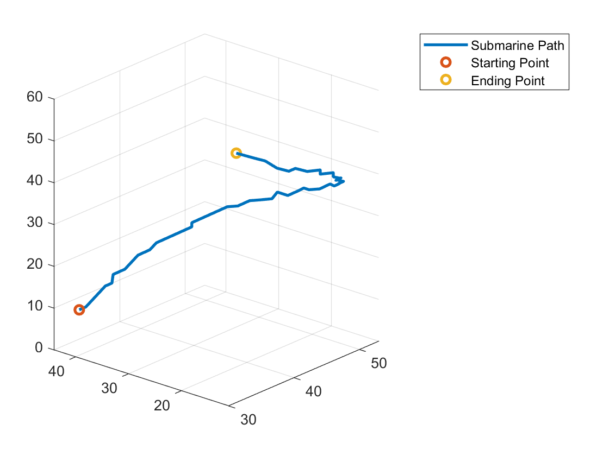

# Signal Denoising and Submarine Tracking
## Problem
In this project we use audio signal data recorded at 30 minute intervals to track the path of a submarine as it moves. The submarine emits a constant frequency as it moves, but we do not know the frequency, so we first have to determine the frequency, and then we can track the location at which that frequency is strongest over time. Our data set contains 64x64x64 tensors representing snapshots of 3D space with each value in a tensor representing a frequency at its given point. 
## Approach
To determine the frequency emitted by the submarine, we take an average across all realizations of our signal in Fourier Space and look for the frequency with the largest amplitude. After determining this frequency, we can apply a Gaussian filter to each realization of our signal around the peak frequency in Fourier space to denoise our signal. We can then use an Inverse Fourier Transform on our filtered signal to return to the time domain, and from here we can record the coordinates of the peak frequency as a point in our submarine's path. 
## Results
Using this approach, we can visualize our solution as a 3D plot:  

A formal write up of this problem, including MATLAB algorithms, a theoretical background, and computational results can be found in [Signal_Denoising.pdf](Signal_Denoising.pdf)
